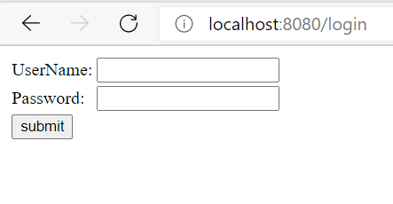
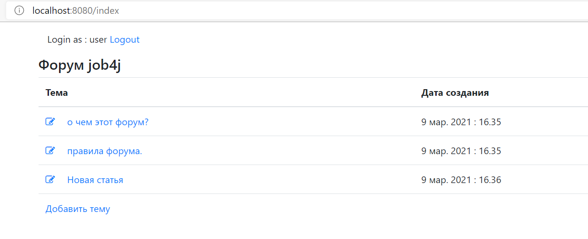
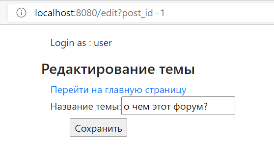
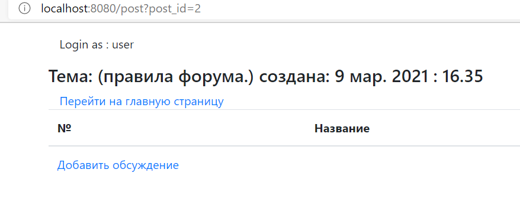
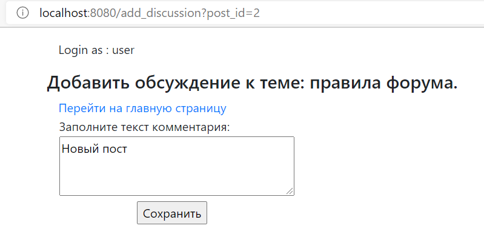
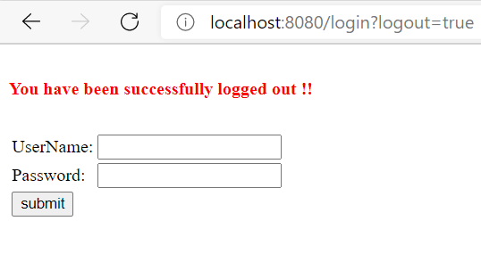

[](https://travis-ci.org/RomanRusanov/job4j_forum)
[](https://www.codacy.com/gh/RomanRusanov/job4j_forum/dashboard?utm_source=github.com&amp;utm_medium=referral&amp;utm_content=RomanRusanov/job4j_forum&amp;utm_campaign=Badge_Grade)
[](https://codecov.io/gh/RomanRusanov/job4j_forum)

[link to heroku deploeyd app](https://desolate-cove-18741.herokuapp.com/)
(UserName: user) (Password: 123)

Реализация простого сайта форума с аутентификацией пользователей

### 1. Аутентификация пользователя

http://localhost:8080/login



### 2. Страница с темами

Можно редактировать существующие темы или создавать новые.

http://localhost:8080/index



### 3. Редактирование темы

http://localhost:8080/edit?post_id{id темы в БД}



### 4. Страница выбранной темы

Можно добавить новый пост

http://localhost:8080/edit?post_id{id темы в БД}



### 5. Добавление нового поста

http://localhost:8080/add_discussion?post_id{id темы в БД}



### 6. Завершение сеанса пользователя

http://localhost:8080/logout



##Конфигурирация

* Необходимо создать БД и указать логин пароль для подключения ```src/main/resources/application.properties```
* ```db/insert.sql``` есть данные для аутентификации пользователя

##Контакты:

* email: roman9628@gmail.com
* skype: rusanov_roman
* telegram: @Roman_Rusanov